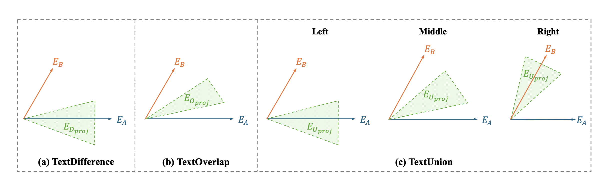

# SOFSAT: Beyond Downstream Tasks — A Set-Theoretic Evaluation of Sentence Embeddings

<p align="center">
  
  <br>
  <em>Figure 1 (paper): Expected projection of the TextOverlap, TextDifference, and TextUnion embeddings onto the plane spanned by the input sentence embeddings A and B.</em>
</p>


This repository contains the code for **"Beyond Downstream Tasks: A Set-Theoretic Evaluation of Sentence Embeddings."**

The paper introduces a set-theoretic framework for evaluating the *compositional* properties of sentence embeddings, independent of any downstream task. Drawing an analogy to classical set theory, it defines three sentence-level "set-like" operators — **TextOverlap** (∩), **TextDifference** (−), and **TextUnion** (∪) — and six evaluation criteria (C1–C6) built on top of them. Using these criteria, 19 sentence encoders (7 classical models and 12 LLM-based encoders) are evaluated on a released benchmark of ≈192K synthetic samples. The key finding: SBERT variants align with these compositional criteria more strongly than much larger LLMs, and adherence to the criteria correlates with downstream summarization performance — suggesting the framework is a useful, label-free proxy for embedding quality.


## 1. Dataset

The ≈192K-sample synthetic benchmark (TextOverlap, TextDifference, TextUnion) is hosted on Hugging Face:

🔗 **https://huggingface.co/datasets/BridgeAI-Lab/STAB**

### Download the dataset

Create a `data/` folder at the repository root and download the dataset into it using the `huggingface-cli`:

```bash
pip install -U huggingface_hub

mkdir -p data

huggingface-cli download BridgeAI-Lab/STAB \
    --repo-type dataset \
    --local-dir data
```

Alternatively, using the `huggingface_hub` Python API:

```python
from huggingface_hub import snapshot_download

snapshot_download(
    repo_id="BridgeAI-Lab/STAB",
    repo_type="dataset",
    local_dir="data",
)
```

After downloading, `data/` should contain the following files, which the experiment scripts read directly:

```
data/
├── final_combined_data.xlsx         # base Sprev/Scurr/Snext/S1/S2 samples
├── intersection_analysis.xlsx       # TextOverlap samples
├── difference_analysis.xlsx         # TextDifference samples
└── LocationExp/
    └── use.xlsx                     # TextUnion samples
```

## 2. Setup

```bash
git clone <this-repo-url>
cd Sofsat
pip install -r requirements.txt
```

A CUDA-capable GPU is strongly recommended — the LLM-based encoders (LLaMA, Mistral, Qwen, Gemma, etc.) are run locally via Hugging Face `transformers`.

## 3. Running the experiments

Each set-like operator has its own experiment driver under `src/` plus a matching shell script at the repo root that handles logging and timing:

| Operator       | Experiment script              | Shell script   |
|----------------|---------------------------------|----------------|
| TextOverlap    | `src/overlap_experiments.py`    | `overlap.sh`   |
| TextDifference | `src/difference_experiments.py` | `difference.sh`|
| TextUnion      | `src/union_experiments.py`      | `union.sh`     |

Each script loops over every model in `MODEL_ENCODER_MAPPING` (see `src/Models/`), encodes the relevant sentences, computes the C1–C6 criteria/angles, and writes a `model_<model_id>.xlsx` results file per model under `Results/<operator>_results/`.

### Run via the shell scripts (recommended)

The shell scripts set up logging (`./logs/`), background-run the experiment, and accept the Hugging Face `model_id` as an optional CLI argument (defaults to `meta-llama/Llama-3.2-3B`):

```bash
# Default model (meta-llama/Llama-3.2-3B)
./overlap.sh
./difference.sh
./union.sh

# Or specify a model explicitly
./overlap.sh "sentence-transformers/all-MiniLM-L6-v2"
./difference.sh "mistralai/Mistral-7B-v0.3"
./union.sh "Qwen/Qwen2.5-7B"
```

Monitor progress with:

```bash
tail -f logs/<model_name>.log
```

### Run the Python scripts directly

```bash
python -u src/overlap_experiments.py    --model "<model_id>" --batch_size 1
python -u src/difference_experiments.py --model "<model_id>" --batch_size 2
python -u src/union_experiments.py      --model "<model_id>" --batch_size 1
```

Key CLI arguments (`src/utils/__argument_parser__.py`):

| Flag           | Default                  | Description                          |
|----------------|---------------------------|--------------------------------------|
| `--model`      | —                          | Model ID used to compute embeddings  |
| `--batch_size` | `2`                        | Batch size for encoding              |
| `--output_dir` | `./Results`                | Where results are written            |
| `--gpu`        | `cuda:0`                   | GPU device                           |

## 4. Generating the paper's tables

After the experiment scripts produce their raw result files, the table-generation scripts under `src/analysis/` turn them into the paper's reported tables:

```bash
# Table 13 (TextOverlap / C1)
python -u src/analysis/overlap/C1_table_13.py --model "<model_id>"

# Table 3 (TextDifference / C4)
python -u src/analysis/difference/C4_table_3_alternative.py --model "<model_id>"

# Table 15 (TextDifference / C3)
python -u src/analysis/difference/C3_table_15.py --model "<model_id>"
```

These are already chained at the end of `overlap.sh` and `difference.sh`, so running those scripts produces the corresponding tables automatically. Output tables are written under `Results/<operator>_results/<model_id>/Table*/`.

## Citation

If you use this code or dataset, please cite:

```bibtex
@inproceedings{mahajan2026sofsat,
  title     = {Beyond Downstream Tasks: A Set-Theoretic Evaluation of Sentence Embeddings},
  author    = {Mahajan, Yash and Bansal, Naman and Kader, Faria Binte and Karmaker, Santu},
  booktitle = {Proceedings of the Annual Meeting of the Association for Computational Linguistics},
  year      = {2026}
}
```
